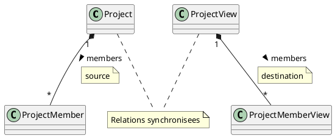

```typescript
    @boc.ModelChanged({
        constr: ProjectView,
    })
    public static async initSyncho(target: ProjectView, msg: boc.Message) {
        let membersSync: boc.RelationSynchronizer<
            Project, ProjectMember, ProjectView, ProjectMemberView>
            = target.mappings.membersSync;
        if (membersSync) {
            await membersSync.set_Source(null);
            for (const member of await target.members.toArray()) {
                await target.members.unlink(member);
            }
        } else {
            membersSync = new boc.RelationSynchronizer<
                Project, ProjectMember, ProjectView, ProjectMemberView>();
            target.mappings.membersSync = membersSync;
        }
        await membersSync.set_Source(target.model.members);
        await membersSync.set_Destination(target.members);
    }
```