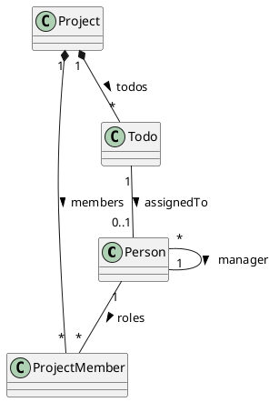

## Rélations



Types de rélations:
    * compositions
        * HasOne
        * HasMany
    * simples
        * Reference
        * Many

* Ajouter le définitions classes et les rélations dans schéma

    Project.json:

```json
{
    "$schema": "http://phenix.salviadeveloppement.com/json-schema/mdr-schema.json",
    "version": "1.0.0",
    "type": "object",
    "title": "Project",
    "name": "Project",
    "primaryKey": "code",
    "properties": {
        "code": {
            "type": "string",
            "format": "code"
        },
        "name": {
            "type": "string"
        },
        "todos": {
            "type": "array",
            "items": {
                "$ref": "#/definitions/TodoRef"
            }
        },
        "members": {
            "type": "array",
            "items": {
                "$ref": "#/definitions/ProjectMemberRef"
            }
        }
    },
    "definitions": {
        "ProjectMemberRef": {
            "type": "object",
            "name": "ProjectMember",
            "title": "Project Member",
            "properties": {
                "role": {
                    "type": "string",
                    "format": "code"
                },
                "personId": {
                    "type": "string",
                    "format": "code"
                }
            },
            "relations": {
                "person": {
                    "foreignEntity": "Person",
                    "foreignKey": [
                        "personId"
                    ],
                    "key": [
                        "personId"
                    ],
                    "multiplicity": "one",
                    "inverseMultiplicity": "many"
                }
            }
        },
        "TodoRef": {
            "type": "object",
            "name": "Todo",
            "title": "Todo item",
            "properties": {
                "title": {
                    "type": "string"
                },
                "progress": {
                    "type": "integer"
                },
                "dueDate": {
                    "type": "string",
                    "format": "date"
                },
                "personId": {
                    "type": "string",
                    "format": "code"
                }
            },
            "relations": {
                "person": {
                    "foreignEntity": "Person",
                    "foreignKey": [
                        "personId"
                    ],
                    "key": [
                        "personId"
                    ],
                    "multiplicity": "one",
                    "inverseMultiplicity": "many"
                }
            }
        }
    }
}
```

    Person.json
```json
{
	"$schema": "http://phenix.salviadeveloppement.com/json-schema/mdr-schema.json",
	"version": "1.0.0",
	"type": "object",
	"title": "Person",
	"name": "Person",
	"primaryKey": "personId",
	"properties": {
		"personId": {
			"type": "string",
			"format": "code"
		},
		"name": {
			"type": "string"
		},
		"firstName": {
			"type": "string"
		},
		"birthDate": {
			"type":"string",
			"format":"date"
		},
		"refManager": {
			"type": "integer"
		}
	},
	"relations": {
		"manager": {
			"foreignEntity": "Person",
			"foreignKey": [
				"id"
			],
			"key": [
				"refManager"
			],
			"multiplicity": "one",
			"inverseMultiplicity": "many"
		},
		"teamMembers": {
			"foreignEntity": "Person",
			"foreignKey": [
				"refManager"
			],
			"key": "id",
			"multiplicity": "one",
			"inverseMultiplicity": "many"
		}
	}
}
```

* Générer les classes model
```
    npm run entity
```

* Ajouter les tests
    src/test/project/project.test.ts

```typescript
describe('Project', function () {
    it('code, name should not be empty', async function () {
        const c = createContainer();
        const project = await c.createNew<Project>(Project);
        await project.validate();
        assert(project.hasErrors);
        let propertyErrors: boc.IErrorInfo[];
        for (const p of projectNotEmptyProperties) {
            propertyErrors = project.errors.errors.get(p);
            assert(propertyErrors && propertyErrors.length);
            const err = propertyErrors.find(
                (e) => e.error.srcId === 'ProjectRules.notEmptyProperties'
            );
            assert(err);
            assert(err.error.message === c.t('Valeur obligatoire'));
            const value = 'not empty';
            await project.setProp(p, value);
            await project.validate();
            propertyErrors = project.errors.errors.get(p);
            assert(!propertyErrors || !propertyErrors.find(
                (e) => e.error.srcId === 'ProjectRules.notEmptyProperties')
            );
        }
    });

    it('members only once', async function () {
        const c = createContainer();
        const project = await c.createNew<Project>(Project);
        const persons: Person[] = [];
        for (let i = 0; i < 2; i++) {
            const person = await c.createNew<Person>(Person);
            const n = i.toString();
            await person.set_personId(n);
            await person.set_name(n);
            await person.set_firstName(n);

            const projectMember = await c.createNew<ProjectMember>(ProjectMember);
            await projectMember.set_person(person);
            await projectMember.set_role('dev');
            await project.members.link(projectMember);
            persons.push(person);
        }

        project.members.link(await c.createNew<ProjectMember>(ProjectMember));
        const m = await c.createNew<ProjectMember>(ProjectMember);
        await m.set_person(persons[0]);
        await m.set_role('dev');
        await project.members.link(m);
        await project.validate();
        assert(project.hasErrors);
        let membersErrors = project.errors.errors.get('members');
        assert(membersErrors && membersErrors.length);
        const err = membersErrors.find(
            (e) => e.error.srcId === 'ProjectRules.membersOnlyOnce'
        );
        assert(
            err &&
            err.error.message ===
            c.t('Les membres suivants sont déclares plusieurs fois dans le projet.\n')
            .concat('0 0')
        );

        await project.members.unlink(m);
        await project.validate();
        membersErrors = project.errors.errors.get('members');
        assert(
            !membersErrors
            || !membersErrors.length
            || !membersErrors.find(
                (e) => e.error.srcId === 'ProjectRules.membersOnlyOnce'
            )
        );
    });
    it('calculate project name', async function () {
        const c = createContainer();
        const project = await c.createNew<Project>(Project);
        let v: string = ProjectRules.getProjectName(project);
        assert(v);
        await project.set_code('c');
        v = ProjectRules.getProjectName(project);
        assert(v === project.code);
        await project.set_name('n');
        v = ProjectRules.getProjectName(project);
        assert(v === project.name);
    });
});
```

    dans src/test/project/project-member.test.ts

```typescript
describe('Project Member', function () {
    it('role should not be empty', async function () {
        const c = createContainer();
        const projectMember = await c.createNew<ProjectMember>(ProjectMember);
        await projectMember.validate();
        assert(projectMember.hasErrors);
        let propertyErrors: boc.IErrorInfo[];
        for (const p of projectMemberNotEmptyProperties) {
            propertyErrors = projectMember.errors.errors.get(p);
            assert(propertyErrors && propertyErrors.length);
            const err = propertyErrors.find(
                (e) => e.error.srcId === 'ProjectMemberRules.notEmptyProperties'
            );
            assert(err);
            assert(err.error.message === c.t('Valeur obligatoire'));
            const value = 'not empty';
            await projectMember.setProp(p, value);
            await projectMember.validate();
            propertyErrors = projectMember.errors.errors.get(p);
            assert(!propertyErrors || !propertyErrors.find(
                (e) => e.error.srcId === 'ProjectMemberRules.notEmptyProperties')
            );
        }
    });
    it('person should not be empty', async function () {
        const c = createContainer();
        const projectMember = await c.createNew<ProjectMember>(ProjectMember);
        await projectMember.validate();
        assert(projectMember.hasErrors);
        let propertyErrors: boc.IErrorInfo[];
        propertyErrors = projectMember.errors.errors.get('person');
        assert(propertyErrors && propertyErrors.length);
        const err = propertyErrors.find(
            (e) => e.error.srcId === 'ProjectMemberRules.checkPersonReference'
        );
        assert(err);
        assert(err.error.message === c.t('Valeur obligatoire'));
        const value = await c.createNew<Person>(Person);
        await projectMember.set_person(value);
        await projectMember.validate();
        propertyErrors = projectMember.errors.errors.get('person');
        assert(!propertyErrors || !propertyErrors.find(
            (e) => e.error.srcId === 'ProjectMemberRules.checkPersonReference')
        );
    });
    it('should block deleting referenced person', async function () {
        const c = createContainer();
        const project = await c.createNew<Project>(Project);
        await project.set_name('P1');
        const projectMember = await c.createNew<ProjectMember>(ProjectMember);
        await project.members.link(projectMember);

        const person = await c.createNew<Person>(Person);
        await person.set_name('J');
        await projectMember.set_person(person);
        await person.toDelete();
        assert(!person.isDeleted);
        const personErrors = person.errors.errors.get('$');
        assert(personErrors);
        const err = personErrors.find(
            (e) => e.error.srcId === 'ProjectMemberRules.doNotDeleteReferencedPerson'
        );
        assert(err);
        assert(err.error.isTransient);
        const expectedMessage =
            c.t('{{0}} participe dans les projets suivants:\n',
                PersonRules.calculateFullName(person))
                .concat('P1');
        assert(err.error.message === expectedMessage);
    });
});
```

* Ajouter les règles métiers
    dans src/lib/rules/project/ProjectRules.ts

```typescript
export const projectNotEmptyProperties: Array<keyof Project & string> = [
    'code', 'name',
];

export class ProjectRules {

    @boc.Validate({
        constr: Project,
    })
    public static async notEmptyProperties(target: Project, msg: boc.Message) {
        for (const propName of projectNotEmptyProperties) {
            Helpers.checkEmptyProp(target, propName);
        }
    }

    @boc.Validate({
        constr: Project,
    })
    public static async membersOnlyOnce(target: Project, msg: boc.Message) {
        const c = target.container;
        const members = await target.members.toArray();
        const nullPersonId = 'nullPersonId';
        const counts = _.countBy(members, (m: ProjectMember) =>
            m.personId ? m.personId : nullPersonId);
        const personIds = Object.getOwnPropertyNames(counts)
            .filter((k) => k !== nullPersonId && counts[k] > 1);
        if (personIds.length) {
            const personNames: string[] = [];
            for (const personId of personIds) {
                const person = await c.getOne<Person>(Person, { personId });
                personNames.push(PersonRules.calculateFullName(person));
            }
            const error: string =
                c.t('Les membres suivants sont déclares plusieurs fois dans le projet.\n')
                .concat(
                    personNames.join('\n')
                );
            target.errors.addError(error, 'members');
        }
    }

    public static getProjectName(p: Project): string {
        return p.name || p.code || p.id.toString();
    }
}
```

    dans src/lib/rules/project/ProjectMemberRules

```typescript
export const projectMemberNotEmptyProperties: Array<keyof ProjectMember & string> = [
    'role',
];
export class ProjectMemberRules {

    @boc.Validate({
        constr: ProjectMember
    })
    public static notEmptyProperties(target: ProjectMember, msg: boc.Message) {
        for (const propName of projectMemberNotEmptyProperties) {
            Helpers.checkEmptyProp(target, propName);
        }
    }
    @boc.Deleting({
        constr: Person
    })
    public static async doNotDeleteReferencedPerson(target: Person, msg: boc.Message) {
        const c = target.container;
        const projectMembers =
            await c.getMany<ProjectMember>(ProjectMember, { personId: target.personId });

        /* istanbul ignore else */
        if (projectMembers.length) {
            const projects: string[] = [];
            for (const m of projectMembers) {
                const project = await m.parentObject();
                projects.push(ProjectRules.getProjectName(project));
            }
            const err =
                c.t('{{0}} participe dans les projets suivants:\n',
                    PersonRules.calculateFullName(target))
                    .concat(
                        projects.join('\n')
                    );
            throw new boc.BOErr(500, err);
        }
    }

    @boc.Validate({
        constr: ProjectMember
    })
    public static async checkPersonReference(target: ProjectMember, msg: boc.Message) {
        const c = target.container;
        const p = await target.person();
        if (!p) {
            target.errors.addError(c.t('Valeur obligatoire'), 'person');
        }
    }
}
```

* Ajouter les classes dans le serveur